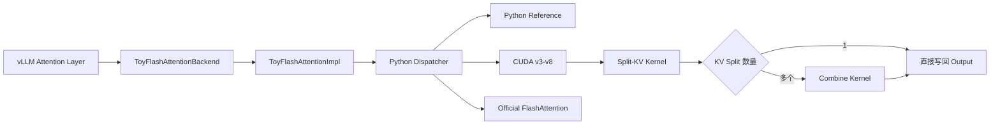

# CUDA Learn

本仓库记录 CUDA Kernel 的学习与性能优化实践，当前核心项目是 `flash_attention_backend`：

> 从零实现支持 Paged KV Cache 的 FlashAttention Forward CUDA Kernel，将其作为自定义 `AttentionBackend` 接入 vLLM，并持续进行正确性验证和性能优化。

当前主线为 **v8 Split-KV 实现**，主要面向 Ampere GPU、BF16、`head_dim=64` 和 Decoder Attention。

## 项目简介

核心能力：

* Paged KV Cache
* GQA
* Varlen Query
* Causal Mask
* Sliding Window
* BF16 输入、FP32 累加
* vLLM 自定义 AttentionBackend
* Python Reference / 自定义 CUDA / 官方 FlashAttention 对拍
* 算子 Benchmark、E2E Benchmark、Nsight Compute 分析
* Attention 调用 Dump / Replay

项目目标不是替代生产级 FlashAttention，而是完整实践：

* CUDA Kernel 设计；
* Tensor Core 和 CuTe 编程；
* Paged-KV Attention 语义；
* Online Softmax；
* Profiler 驱动的性能优化；
* 自定义 CUDA 算子与真实推理框架集成。

## 核心成果

测试环境：

* GPU：NVIDIA GeForce RTX 2050
* CUDA：12.8
* PyTorch：2.10.0
* vLLM：0.17.1
* 数据类型：BF16
* Head Dim：64

### 算子性能

| Case                 | v7       | v8       | Official | v8 / Official |
| -------------------- | -------- | -------- | -------- | ------------- |
| `gpt2_like_b1_s128`  | 0.091 ms | 0.061 ms | 0.051 ms | 1.2×          |
| `gqa_case_b1_s128`   | 0.139 ms | 0.060 ms | 0.065 ms | 0.9×          |
| `qwen_like_b1_s128`  | 0.262 ms | 0.058 ms | 0.046 ms | 1.3×          |
| `qwen_like_b1_s2048` | 3.495 ms | 0.204 ms | 0.071 ms | 2.9×          |
| `qwen_like_b4_s512`  | 0.939 ms | 0.197 ms | 0.070 ms | 2.8×          |

主要结果：

* v8 在 `qwen_like_b1_s2048` 上相较 v7 提升约 **17×**。
* 短序列 Case 中，v8 达到官方对照路径的约 `0.9～1.3×`。
* v8 的 Global Excessive Sectors 在当前采集 Case 中降至 `0`。
* L2 Hit Rate 从 v7 的约 `50%` 提升至 `81%～86%`。
* Shared Bank Conflicts 已从百万级降低到千级。
* 单线程寄存器使用从 `176` 降至 `144`。

### vLLM 端到端性能

| Case           | Version  | Output Tokens/s |
| -------------- | -------- | --------------- |
| `qwen_b1_t128` | v7       | 34.4            |
| `qwen_b1_t128` | v8       | 56.6            |
| `qwen_b1_t128` | Official | 84.7            |
| `qwen_b4_t128` | v8       | 195.3           |
| `gpt2_b1_t128` | v8       | 156.1           |

在 `qwen_b1_t128` 中，v8 是 v7 的约 **1.65×**，达到官方实现的约 **67%**。

> Official 算子路径与自定义 Paged-KV 路径并非完全同构，数据主要作为性能上界参考。

完整数据见 [性能评估报告](flash_attention_backend/docs/PERFORMANCE_EVAL.md)。

## 架构与版本演进

### 当前架构



Paged KV Cache 布局：

```text
K/V: [num_blocks, block_size, num_kv_heads, head_dim]

logical token
    → logical block + offset
    → block_table[batch][logical block]
    → physical KV block
```

v8 的主要设计：

* 将 KV 序列切成多个 Split，由不同 CTA 并行处理。
* 使用 Tensor Core MMA 完成 `Q × K` 和 `P × V`。
* Score、Softmax Max/Sum、Online Rescale 和 Output Accumulator 保存在寄存器中。
* K/V Tile 使用双缓冲和 `cp.async`。
* 使用 `uint128_t` 向量化 Global-to-Shared Copy。
* 使用 Swizzle 和显式 LDSM Copy Atom 降低 Bank Conflict。
* 单 Split 时跳过 Combine，直接写回结果。
* 多 Split 时写回 Partial Output 和 LSE，再由 Combine Kernel 合并。

### 版本演进

| 版本       | 核心变化                                    |
| -------- | --------------------------------------- |
| Baseline | Python Paged-KV Reference，定义语义基准        |
| v3       | 第一版完整 CUDA Forward、分块 QK、Online Softmax |
| v4       | 重构接口，增加 BF16/FP32 调试路径和 GQA             |
| v5       | 使用 WMMA，将 QK 和 P×V 迁移到 Tensor Core      |
| v6       | 使用 CuTe 重构线程、寄存器、SMEM 和 MMA Layout      |
| v7       | KV-head-first、向量化加载、Swizzle、LDSM        |
| v8       | Split-KV、全寄存器计算、双缓冲、Combine Kernel      |

v7 主要解决访存问题：

* 通过 KV-head-first 减少 GQA 中的 K/V 重复读取；
* 使用 128-bit Load、`cp.async`、Swizzle 和 LDSM；
* Shared Bank Conflicts 从约 282 万降低到 6.3 万；
* Global Excessive Sectors 降至 3584。

但 v7 的长 KV 仍主要在单 CTA 内串行遍历，CTA 并行度不足。

v8 将优化重点转向架构：

* 使用多 CTA 并行处理不同 KV Split；
* 全寄存器完成 QK、Softmax 和 P×V；
* 修复不完整 KV Block 中无效值导致的 NaN 污染；
* Global Excessive Sectors 降至 0；
* 长序列算子性能较 v7 提升约 17×。

当前瓶颈已经从访存冲突转向：

* CTA 和 Grid 排布；
* Split 数量选择；
* 低 Occupancy 下的调度效率；
* Combine Kernel 开销。

## 验证与性能工程

### 正确性验证

验证分为五层：

1. Python Reference 语义对拍；
2. 官方 FlashAttention 对拍；
3. Paged-KV、GQA、Causal 和 Window 单测；
4. CUDA Regression 与 Dump Replay；
5. vLLM 端到端生成验证。

当前统一 Correctness Collect：

* 5 个 Case 全部通过 Strict 阈值；
* `v8 + head_dim=64 + BF16` 最小 Case 与 Reference 精确一致；
* 已覆盖非 Identity Block Table、Causal 和 Local Window。

主要测试目录：

```text
flash_attention_backend/tests/correctness/
├── test_fa2_parity.py
├── test_paged_kv_parity.py
├── test_cuda_regression.py
├── test_replay_dumps.py
└── _helpers.py
```

Dump Attention 调用：

```bash
export TOY_FLASH_ATTN_DUMP_DIR=/tmp/fa_dump
```

Replay 主要用于：

* 复现特定 Attention 调用；
* 定位最早产生数值漂移的 Decode Step；
* 区分输入污染和 Kernel 输出错误；
* 分析 NaN、Inf 和误差累积。

### 代表性优化

#### 向量化加载

将窄粒度 Global Load 调整为 `uint128_t` 和 `cp.async`，当前 v8 采集 Case 的 Global Excessive Sectors 均为 `0`。

#### Shared-Memory Layout

通过 Swizzle、Padding 和显式 LDSM Copy Atom，使 Shared Bank Conflicts 从百万级逐步下降到千级。

#### Split-KV

v7 的主要瓶颈是单 CTA 串行遍历长 KV。v8 使用多 CTA Split-KV，并通过 Partial Output 和 LSE 完成跨 Split 合并，长序列性能提升约 17×。

#### 寄存器压力

移除额外的 `block_o` Fragment，直接 Online 更新 Output Accumulator，将寄存器使用从 `176` 降至 `144`，Occupancy 恢复到约 20%。

性能优化流程：

```text
Benchmark
    → 定位 NCU 指标
    → 查看源码热点和 SASS
    → 提出 Layout / 访存 / 并行度假设
    → 单变量修改
    → 正确性回归
    → 重新采集 Benchmark 和 NCU
    → 记录到 Dev Log
```

## 环境搭建

本项目固定使用 Python 3.10 和仓库根目录下的 `venv` 虚拟环境进行开发与运行。

### 1. 创建虚拟环境

```bash
git clone https://github.com/solidcc2/cuda-learn.git
cd cuda-learn

python3.10 -m venv vllm_env
source vllm_env/bin/activate
```

要求：

* 必须使用 Python 3.10；
* 虚拟环境必须命名为 `vllm_env`；
* 虚拟环境位于仓库根目录。

### 2. 安装依赖

```bash
pip install --upgrade pip
pip install -r requirements.txt
```

`requirements.txt` 中包含：

* PyTorch
* vLLM
* 测试与分析工具（pytest、Nsight Compute 相关依赖等）

## 快速使用
运行inference case

```bash
cd flash_attention_backend

# default: v8
python test_self_flash_attn_backend.py

# use: vllm official
TOY_FLASH_ATTN_USE=official python test_self_flash_attn_backend.py
```


## 项目边界与导航

### 当前限制

* 当前主要 Specialization 为 `head_dim=64`。
* 主要支持 BF16 输入和 FP32 累加。
* 仅实现 Forward。
* 当前实现中 `Q_BLOCK=64`，更接近 Prefill 场景（多 token 并行），尚未针对 Decode（`q_len=1`）做专门特化优化。
* Decode 路径目前仍复用同一 Kernel，Prefill/Decode 的性能分化与专用优化尚未完善。
* Split 数量尚未根据问题规模自动寻优。
* Combine Kernel 尚未充分优化。
* 构建过程仍依赖当前本地 vLLM 和 CUTLASS/CuTe 环境。
* 不同 GPU 和软件环境下的性能结果不可直接比较。

### 仓库结构

```text
.
├── devlog.md
├── requirements.txt
│
├── flash_attention_backend/
│   ├── toy_flash_attn/      # Kernel 与 vLLM 接入
│   │   └── v3/ ... v8/      # Kernel 版本演进
│   ├── tests/               # 正确性与回归测试
│   ├── bench/               # Op / E2E Benchmark
│   ├── analysis/            # NCU 采集与报告生成
│   └── docs/                # 性能计划与详细报告
│
└── cuda_code/               # 基础 CUDA 算子练习
```

### 后续方向

1. 根据 SM 数量和问题规模自动选择 CTA 与 Split 数量；
2. 分析并降低 Combine Kernel 开销；
3. 提高低 Occupancy 场景下的 Scheduler 利用率；
4. 增加 `head_dim=128`；
5. 对 decode/qlen=1 做 q head 展开和优化；
6. 提供可复现的独立构建环境；
7. 增加自动化性能回归和可视化。

### 详细文档

* [开发日志](devlog.md)
* [性能评估报告](flash_attention_backend/docs/PERFORMANCE_EVAL.md)
* [性能优化计划](flash_attention_backend/docs/PERF_PLAN.md)
* [Toy FlashAttention 文档](flash_attention_backend/toy_flash_attn/README.md)
